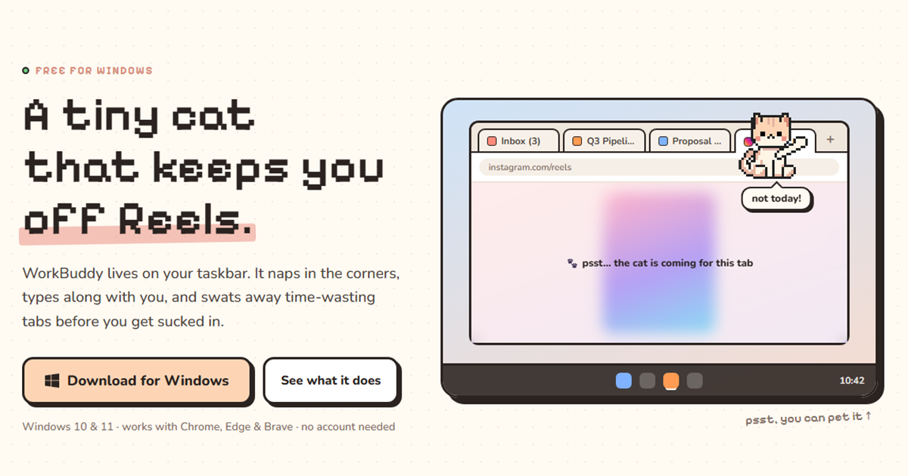

# WorkBuddy 🐾

A tiny pixel cat that lives on your Windows taskbar. It naps in the corners, types along with you,
and swats away Reels and Shorts tabs before you get sucked in.

**Website:** https://www.workbuddycat.online · **Download:** [latest release](https://github.com/sachin-aerosend/workbuddy/releases/latest)



## What it does

- **Closes time-wasting tabs:** Instagram Reels, YouTube Shorts and Facebook Reels by default. The page blurs, the cat runs over and swipes the tab shut.
- **Nudges forgotten tabs:** a thought bubble asks whether to close tabs you haven't touched in an hour (with undo).
- **Types along with you:** a tiny keyboard, left/right paws follow your keys. It only knows *which side* you pressed, never *what*.
- **Lives on your screens:** walks the taskbar, strolls on your tab bar, hops between monitors, plays with yarn, naps when you're away. Drag it and drop it and it lands.
- **Reminds you to drink water:** every 30 minutes at your desk (you can change it) the cat sips from her glass and asks if you had one, and counts your glasses for the day. Time away doesn't count.
- **Invisible on screen share** and hidden during full-screen apps.

### On Android (beta)

- **Lives in the status bar:** tiny, between the clock and the battery, in the free space she measures herself. Tap to bring her down to play, long-press for her menu; swiping down still opens your notifications.
- **Focus mode:** pick the apps that eat your time. Per app, either *whole app* (she asks "how long?" when you open it, shows the countdown beside her and closes the app at zero, then keeps it shut for a cooldown) or *just Reels / Shorts* (the app stays open, the feed gets swatted).
- **Water, reminders, break nudges, typing buddy,** each with its own switch. Nothing leaves the phone.

## Project layout

| Folder | What's in it |
|---|---|
| `app/` | Electron desktop app (main process, cat "brain", renderer, local bridge) |
| `extension/` | Chrome / Edge / Brave extension (MV3) that watches tabs and talks to the app on `127.0.0.1:47821` |
| `website/` | Static landing page (deployed on Vercel) |
| `android/` | WorkBuddy for Android (Kotlin): status-bar cat hosted by an accessibility service, Focus mode app timers, Reels/Shorts swatting, water and reminders |
| `tools/` | Sprite generator, icon builder, tests and dev helpers |

## Develop

```bash
npm install
npm start          # run the app
npm test           # headless behaviour simulation
npm run dist       # build the Windows installer into dist/
```

Load the extension with **chrome://extensions → Developer mode → Load unpacked → `extension/`**.

`npm run sprites` regenerates the art from the original CatPack source files, which are not in this repo
(they're a third-party asset pack). The generated sprites in `app/renderer/sprites/` are included.
